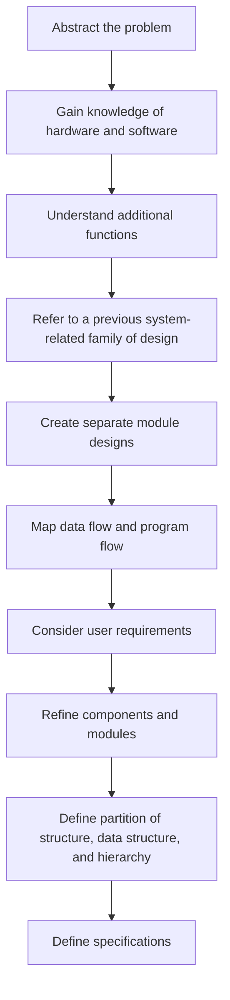
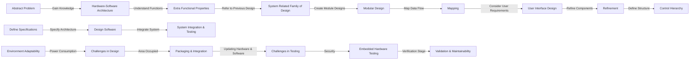

# Embedded System Design: Steps in the Design Process

An Embedded system is a controller that controls many other electronic devices. It is a combination of embedded hardware and software, including microprocessors and micro-controllers. This article discusses the steps involved in embedded system design.

## Embedded System Design

**Definition:** A system designed by embedding hardware and software together for a specific function with a compact area is embedded system design. In this design, a microcontroller plays a vital role, based on the Harvard architecture.

### Types of Embedded Systems

1. **Stand-Alone Embedded System**
2. **Real-Time Embedded System**
3. **Networked Appliances**
4. **Mobile devices**

### Elements of Embedded Systems

1. Processor
2. Microprocessor
3. Microcontroller
4. Digital signal processor

## Steps in the Embedded System Design Process

The different steps in the embedded system design flow/flow diagram include the following.

### 1. Abstraction

In this stage, the problem related to the system is abstracted.

### 2. Hardware – Software Architecture

Proper knowledge of hardware and software is necessary before starting any design process.

### 3. Extra Functional Properties

Understanding extra functions to be implemented completely from the main design.

### 4. System Related Family of Design

When designing a system, refer to a previous system-related family of design.

### 5. Modular Design

Create separate module designs that can be used later on when required.

### 6. Mapping

Based on software mapping, map data flow and program flow into one.

### 7. User Interface Design

In user interface design, consider user requirements, environment analysis, and the function of the system.

### 8. Refinement

Refine every component and module appropriately so that the software team can understand.

### 9. Control Hierarchy

- Partition of structure
- Data structure and hierarchy
- Software Procedure

Architectural description language is used to describe the software design.

## Embedded System Design Software Development Process Activities

There are various design metrics required to design any system to function properly, including:

| Design Metrics        | Function                                             |
| ---------------------- | ---------------------------------------------------- |
| **Power Dissipation**  | Always maintained low                                |
| **Performance**        | Should be high                                       |
| **Process Deadlines**  | The process/task should be completed within a specified time. |
| **Manufacturing Cost** | Should be maintained.                                |
| **Engineering Cost**   | It is the cost for the edit-test-debug of hardware and software. |
| **Size**               | Size is defined in terms of memory RAM/ROM/Flash Memory/Physical Memory. |
| **Prototype**          | It is the total time taken for developing a system and testing it. |
| **Safety**             | System safety should be taken like phone locking, user safety like engine break down safety measure must be taken. |
| **Maintenance**        | Proper maintenance of the system must be taken, in order to avoid system failure. |
| **Time to market**     | It is the time taken for the product/system developed to be launched into the market. |

### Embedded Software Development Process Activities

1. **Specifications:**
   Proper specifications are made, focusing on hardware, design constraints, life cycle period, and resultant system behavior.

2. **Architecture:**
   Specification of hardware and software architecture layers.

3. **Components:**
   Design of components like single-process processor, memories (RAM/ROM), peripheral devices, buses, etc.

4. **System Integration:**
   Integration of all components into the system and testing to meet designer expectations.

## Challenges in Embedded System Design

While designing any embedded system, designers face numerous challenges such as:

- Environment adaptability
- Power consumption
- Area occupied
- Packaging and integration
- Updating in hardware and software
- Security

### Challenges in Testing

Designers face challenges in testing like embedded hardware testing, verification stage, validation maintainability.

## Embedded System Design Examples

- Automatic chocolate vending machine (ACVM)
- Digital camera
- Smart card
- Mobile phone
- Mobile computer, etc.

